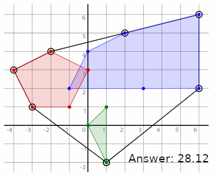

# Trying Out Elixir

Just a simple repository with some small tutorials I followed and a port of my JavaScript rope length calculator (see below).

## Files

- tutorials/tutorial

  Testing out functional programming concepts with a logic example from: https://youtu.be/eis11j_iGMs

- tutorials/tutorial2

  Played around with simple currying concepts

- rope_length_calculator/*

  A port of a JavaScript program I made for a programming challenge. The problem that needed to be solved was to accept several polygons, with their points and calculate the minimum length of a cord to be able to surround them. Here is an example image:

